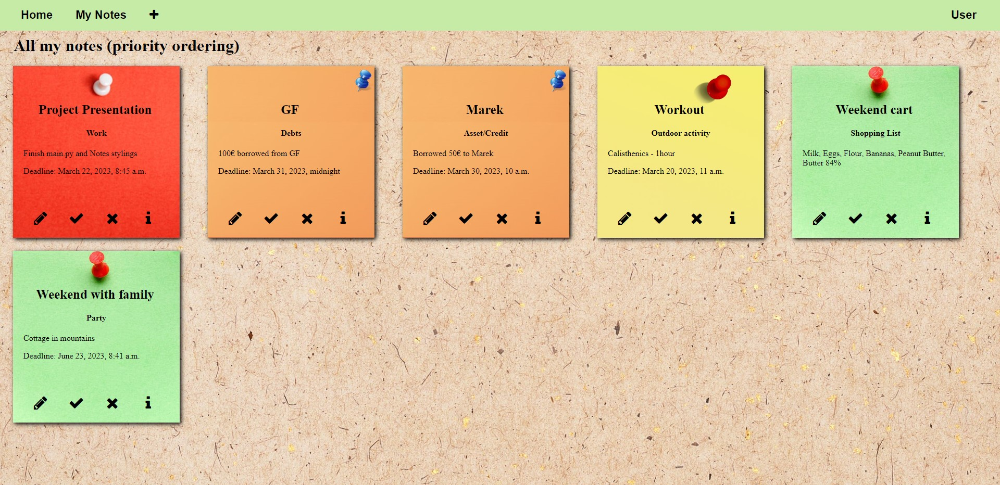
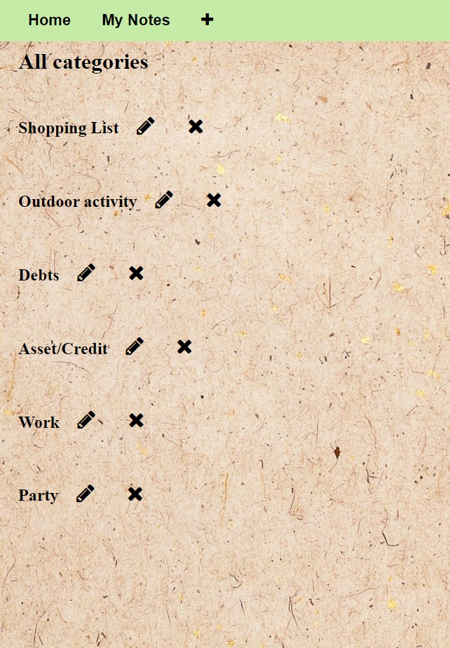
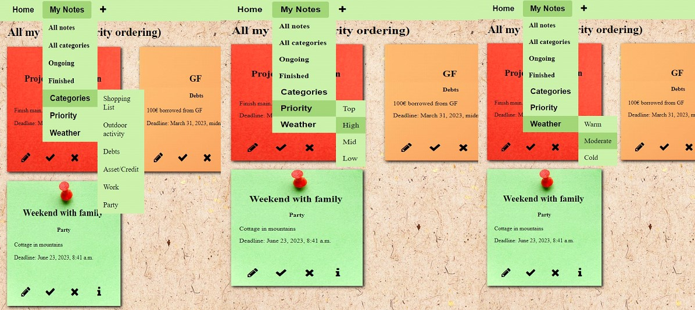
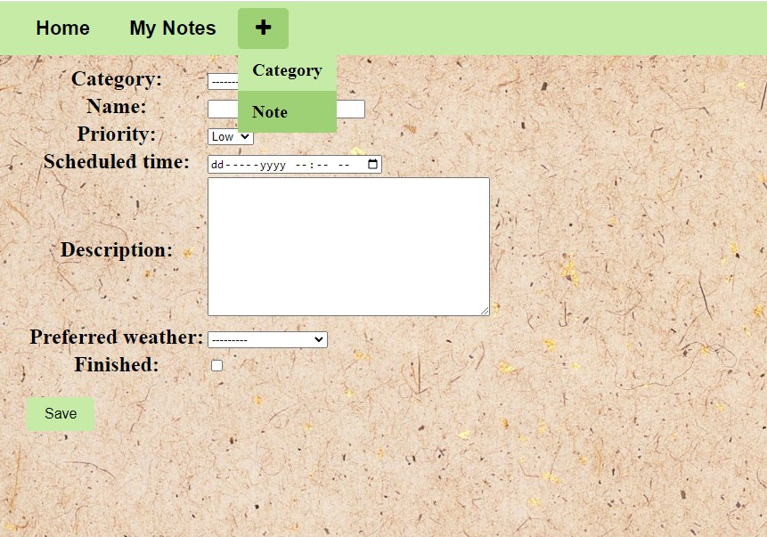
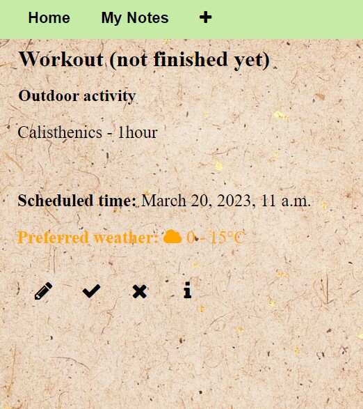
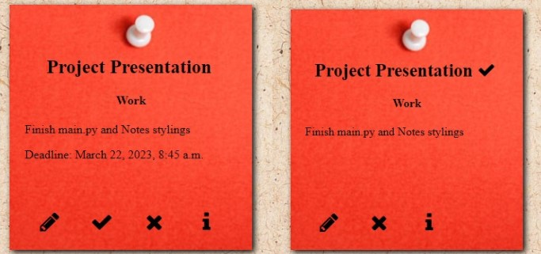

 # NotesApp
 
 ## Welcome to NoteApp, where you can manage your categories and notes, add/edit/delete/finish etc..

 ## Functionalities:
- Registration and Login/Logout (jump to Django database if user is Admin)
- Homepage with greetings and your currently lowest-time remaining note
- My Notes with view of all your notes in database
- Navigation bar with Home (homepage), My Notes (filters) and a + icon, where you can add Category or Note
- Adding category is just name, to add Note you will choose from:
  - name
  - category
  - priority - Low, Mid, High, Top (divided by background color of Note)
  - scheduled time (optional)
  - description
  - preferred weather (optional) - Cold, Moderate or Warm
  - finished or not (if finished, scheduled time will disappear)
- Various filters:
  - all notes
  - all categories
  - Ongoing (not finished)
  - Finished
  - by Category (filter all notes with specific category)
  - by Priority
  - by Weather
- Each Note can be modified to your liking, you can edit/delete/finish or review its detail (4 buttons under each note)
- If content of Note is too big, you can scroll in it
- In Weather filtering, if preferred weather is Cold and current temperature of user isn't in that range, caution will arise

 # All notes

 # All categories

 # Filtering

 # Adding a Note

 # Note Detail

 # Ongoing / Finished
